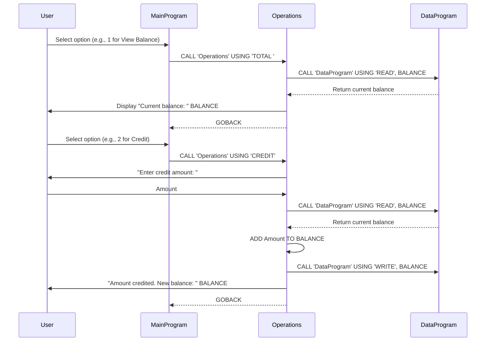

# COBOL Account Management System Documentation

This document describes the COBOL programs in the `src/cobol/` directory, which implement a simple student account management system.

## Files Overview

### main.cob
**Purpose**: Serves as the main entry point for the account management system, providing a user interface menu.

**Key Functions**:
- Displays a menu with options: View Balance, Credit Account, Debit Account, Exit.
- Accepts user input for menu selection.
- Calls the `Operations` program based on the user's choice.
- Handles invalid inputs and program exit.

### operations.cob
**Purpose**: Handles the core business logic for account operations, including crediting, debiting, and viewing the balance.

**Key Functions**:
- `TOTAL`: Retrieves and displays the current account balance.
- `CREDIT`: Prompts for an amount, adds it to the balance, and updates the stored balance.
- `DEBIT`: Prompts for an amount, checks if sufficient funds are available, subtracts the amount if possible, and updates the balance; otherwise, displays an error message.

**Business Rules**:
- Debits are only processed if the current balance is greater than or equal to the debit amount (insufficient funds check).
- All amounts are handled as decimal values (up to 6 digits before decimal, 2 after).

### data.cob
**Purpose**: Manages persistent storage and retrieval of the account balance data.

**Key Functions**:
- `READ`: Retrieves the current balance from storage and passes it back.
- `WRITE`: Updates the stored balance with a new value.

**Business Rules**:
- The initial account balance is set to $1000.00 for all student accounts.
- Balance is stored in a working-storage variable, simulating persistent data (in a real system, this would connect to a database).

## Overall System Notes
- The system uses subprogram calls (`CALL`) to modularize functionality.
- All programs are written in COBOL and designed for console-based interaction.
- This is a simplified model for educational purposes, demonstrating basic account operations with validation.

## Sequence Diagram

The following Mermaid sequence diagram illustrates the data flow for typical operations (viewing balance and crediting an account). The diagram shows interactions between the user, MainProgram, Operations, and DataProgram.

